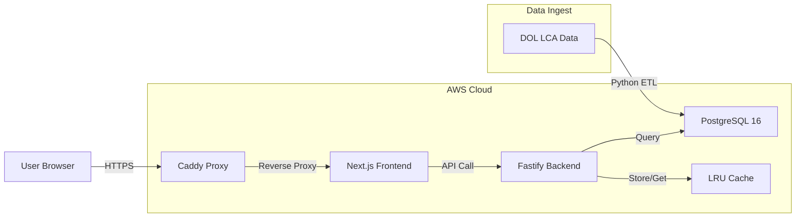

# 🇺🇸 H1B Friendly

[](https://opensource.org/licenses/MIT)
[](https://nextjs.org/)
[](https://www.fastify.io/)
[](https://www.postgresql.org/)

**H1B Friendly** is a high-performance, open-source platform designed to analyze millions of US Department of Labor (DOL) LCA filings. It provides instant insights into sponsorship trends, salary benchmarks, and company rankings, optimized to run on resource-constrained infrastructure.

---

## 🏗 System Architecture

We employ a modern, containerized stack optimized for high-throughput analytical queries.



---

## ⚡️ Performance Engineering

Handling **4 million records** on a 2GB RAM / 2 vCPU (`t3.small`) instance required surgical optimization:

### 1. Database: Covering Indexes (Index-Only Scans)

Standard indexes were insufficient as the constant disk I/O for row fetching throttled the server. We implemented specialized **Covering Indexes** using the `INCLUDE` clause.

- **Result**: Core aggregations perform **100% in-memory** Index-Only Scans, reducing latency from ~75s to **3s**.

### 2. Application: Memory-Level Caching

Even with optimized SQL, concurrent dashboard refreshes can peg the CPU. We implemented a global **LRU In-Memory Cache** at the Fastify layer.

- **Cache Hit Latency**: **<2ms** (a 4,500x improvement over cold queries).
- **TTL Configuration**: Set to 24 hours to accommodate the quarterly DOL data update cycle.

---

## 📂 Project Structure

- **`apps/etl`**: Python-based high-speed ingest pipeline using `Pandas` and `Psycopg2`.
- **`apps/backend`**: Fastify REST API providing normalized H1B analytics.
- **`apps/web`**: Next.js App Router frontend for data visualization and SEO.
- **`infra/`**: Terraform configurations for idempotent AWS provisioning.

---

## 🚀 Quick Start

### 1. Prerequisites

- Docker & Docker Compose
- Node.js 20+

### 2. Launch Stack

```bash
# Clone the repository
git clone https://github.com/ewangchong/h1bfriendly.com.git
cd h1bfriendly.com

# Start services
docker compose up -d
```

### 3. Ingest Data

Follow the instructions in `apps/etl/README.md` to load the latest DOL datasets into your local database.

---

## 🛡️ Security

Traffic is strictly routed through a **Caddy** reverse proxy, which manages automatic SSL certificates via Let's Encrypt and masks internal application ports (3000, 8089) from the public internet.

---

## ⚖️ License

Distributed under the MIT License. See `LICENSE` for more information.

---

_Developed with ❤️ for the H1B community._
