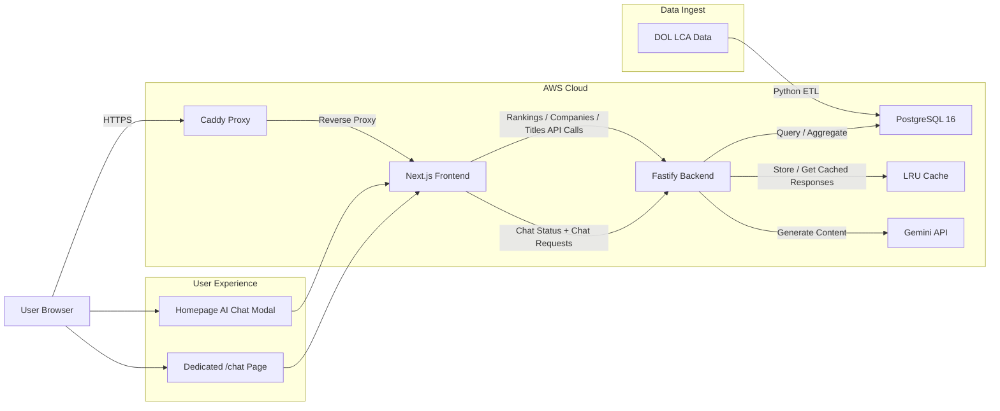

# 🇺🇸 H1B Friendly

[](https://opensource.org/licenses/MIT)
[](https://nextjs.org/)
[](https://www.fastify.io/)
[](https://www.postgresql.org/)

**H1B Friendly** is a high-performance, open-source platform designed to analyze millions of US Department of Labor (DOL) LCA filings. It provides instant insights into sponsorship trends, salary benchmarks, and company rankings, optimized to run on resource-constrained infrastructure.

The homepage now includes an AI chat launcher that opens a modal assistant with a blurred backdrop, so users can ask sponsor and salary questions without leaving the rankings view.

---

## 🏗 System Architecture

We employ a modern, containerized stack optimized for high-throughput analytical queries.



---

## ⚡️ Performance Engineering

Handling **4 million records** on a 2GB RAM / 2 vCPU (`t3.small`) instance required surgical optimization:

### 1. Database: Covering Indexes (Index-Only Scans)

Standard indexes were insufficient as the constant disk I/O for row fetching throttled the server. We implemented specialized **Covering Indexes** using the `INCLUDE` clause.

- **Result**: Core aggregations perform **100% in-memory** Index-Only Scans, reducing latency from ~75s to **3s**.

### 2. Application: Memory-Level Caching

Even with optimized SQL, concurrent dashboard refreshes can peg the CPU. We implemented a global **LRU In-Memory Cache** at the Fastify layer.

- **Cache Hit Latency**: **<2ms** (a 4,500x improvement over cold queries).
- **TTL Configuration**: Set to 24 hours to accommodate the quarterly DOL data update cycle.

---

## 📂 Project Structure

- **`apps/etl`**: Python-based high-speed ingest pipeline using `Pandas` and `Psycopg2`.
- **`apps/backend`**: Fastify REST API providing normalized H1B analytics.
- **`apps/web`**: Next.js App Router frontend for data visualization and SEO.
- **`infra/`**: Terraform configurations for provisioning the AWS networking and EC2 host.
- **`scripts/`**: Operational helpers such as cache warmup and deployment-side maintenance utilities.
- **`docker-compose.yml`**: Local and single-host production orchestration for PostgreSQL, backend, web, migrations, and Caddy.
- **`Caddyfile`**: Reverse proxy and HTTPS entrypoint configuration for the public site.

---

## 🤖 AI Chat

The product includes an H1B data assistant that is available in two places:

- The dedicated `/chat` page
- A homepage modal launcher that opens on top of the rankings page with a blurred backdrop

The assistant is not a generic chatbot. It is grounded with RAG-style context generated from the local H1B dataset, including:

- The selected or latest fiscal year
- Year-level totals for filings, approvals, and average salary
- Top companies for the selected year
- Top job titles for the selected year
- Question-relevant employer and title slices pulled from the database

Current behavior and limits:

- The assistant answers in English
- It is intended for sponsor trends, approval patterns, salary benchmarks, and company/title comparisons
- It should avoid making factual claims outside the provided dataset context
- Chat is disabled unless `GEMINI_API_KEY` is configured
- The recommended default model is `gemini-2.5-flash`
- Backend rate limiting is controlled by `CHAT_RATE_LIMIT_PER_MIN`

When Gemini fails upstream, the API now returns the upstream model/quota message directly so production issues are easier to diagnose.

---

## 🚀 Quick Start

### 1. Prerequisites

- Docker & Docker Compose
- Node.js 20+

### 2. Configure Environment

Create a root `.env` file before launching the stack:

```bash
POSTGRES_PASSWORD=change_me
GEMINI_API_KEY=your_gemini_api_key
GEMINI_MODEL=gemini-2.5-flash
CHAT_RATE_LIMIT_PER_MIN=20
```

`GEMINI_API_KEY` is optional if you do not want AI chat enabled.

### 3. Launch Stack

```bash
# Clone the repository
git clone https://github.com/ewangchong/h1bfriendly.com.git
cd h1bfriendly.com

docker compose up -d
```

`docker compose` will run a one-shot `migrate` job before the backend starts, so required database indexes are created automatically on fresh environments.

The chat endpoint is disabled unless `GEMINI_API_KEY` is present in the root `.env` file or shell environment used for `docker compose up -d --build`.
The recommended default model is `gemini-2.5-flash`.

### 4. Ingest Data

Follow the instructions in `apps/etl/README.md` to load the latest DOL datasets into your local database.

### 5. Run Migrations Manually

If you need to apply database changes without bringing up the full stack:

```bash
cd apps/backend
npm run build
npm run migrate
```

---

## 🛡️ Security

Traffic is strictly routed through a **Caddy** reverse proxy, which manages automatic SSL certificates via Let's Encrypt and masks internal application ports (3000, 8089) from the public internet.

---

## ⚖️ License

Distributed under the MIT License. See `LICENSE` for more information.

---

_Developed with ❤️ for the H1B community._
