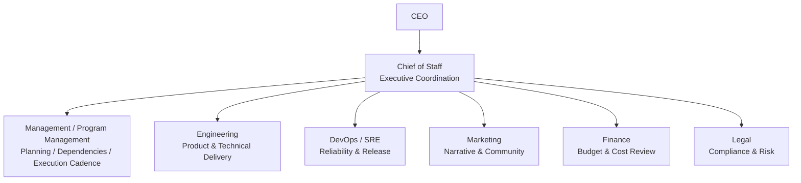
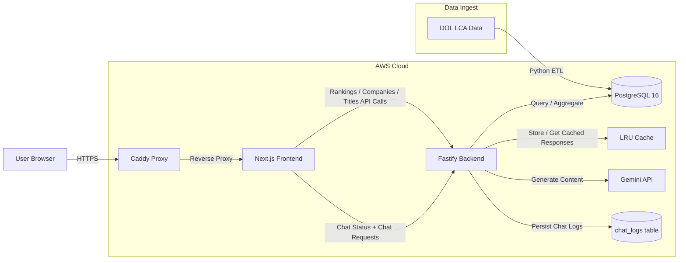

# 🇺🇸 H1B Finder

[](https://opensource.org/licenses/MIT)
[](https://nextjs.org/)
[](https://www.fastify.io/)
[](https://www.postgresql.org/)

**H1B Finder** is a high-performance, open-source platform for exploring millions of U.S. Department of Labor (DOL) LCA filings. It helps users understand sponsorship trends, salary benchmarks, and employer patterns through a fast web experience designed to run on modest infrastructure.

The product also includes an AI assistant that helps users explore sponsor and salary questions based on the local dataset.

---

## 👥 Team

H1B Finder is maintained by a small specialized AI team with clear operating boundaries. Rather than letting multiple agents operate in an unstructured loop, we separate **coordination, execution management, and functional execution**.

### Public-facing team roles

- **CEO** — sets direction, priorities, and final decisions
- **Chief of Staff** — the single coordination entry point across teams
- **Management / Program Management** — planning, owners, dependencies, timelines, and execution cadence
- **Engineering** — product development, architecture, and feature delivery
- **DevOps / SRE** — deployment, reliability, performance, and release safety
- **Marketing** — positioning, launch narrative, and community communication
- **Finance** — budget, cost controls, and capacity trade-offs
- **Legal** — compliance, licensing, privacy, and data-boundary review

### Team structure



### Operating principles

1. **The Chief of Staff is the single coordination entry point** for cross-functional execution.
2. **Management drives planning and execution cadence, not a second command center** — it owns owners, blockers, deadlines, and follow-through.
3. **Each functional team is accountable for judgment in its own domain** — engineering, infrastructure, marketing, finance, and legal keep clear boundaries.

This structure helps us move fast without sacrificing accountability, reviewability, or execution discipline.

---

## 🏗 System Architecture



---

## ⚡ Performance Highlights

- Optimized for **4M+ records** on a modest `t3.small` footprint
- Uses **covering indexes** for index-only scans
- Uses **Fastify in-memory LRU caching** for repeated analytical queries
- Supports a grounded AI assistant for employer and salary exploration

---

## 🚀 Quick Start

### 1. Prerequisites

- Docker & Docker Compose
- Node.js 20+

### 2. Configure Environment

Create a root `.env` file before launching the stack:

```bash
POSTGRES_PASSWORD=change_me
GEMINI_API_KEY=your_gemini_api_key
GEMINI_MODEL=gemini-2.5-flash
CHAT_RATE_LIMIT_PER_MIN=20
```

### 3. Launch Stack

```bash
git clone https://github.com/ewangchong/h1bfinder.com.git
cd h1bfinder.com
docker compose up -d
```

---

## ⚖️ License

Distributed under the MIT License. See `LICENSE` for more information.
